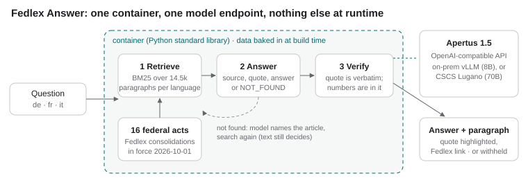

# Technical report — Fedlex Answer

A deeper write-up than the README: what was built, how it works, and what the numbers say.

- **Track:** Track 2B — Fedlex Answer
- **Event:** Online
- **Team:** KHLab — Aleksandr Khrukalo
- **Demo:** [video, 1:47](https://youtu.be/CbTLmXqyZwQ), `make run` for the app, `make eval` for every number below

## 1. Summary

Residents and front-desk officials ask short questions whose answer is fixed by a federal act: a notice period,
an objection deadline, a quorum. Asked directly, Apertus 70B answers 41% of 1,611 such questions correctly and
52% confidently wrong, and on rules amended since 2021 it states the old value more often than the current one
(Swiss Statute QA, our Track 1B dataset). Fedlex Answer makes Apertus answer from the statute and checks in code
that it did: retrieve the paragraphs, have the model name its source paragraph and copy the words that decide the
case, and withhold any answer whose quote is not in the paragraph or whose numbers are not in the quote. On the
same 1,611 questions, Apertus 70B goes from **41% correct / 52% wrong to 83% correct / 6% wrong**, and the 8B model that fits on one
GPU from 19% / 26% to 76% / 9%, every answer
carries a Fedlex link and the highlighted wording, and the whole system is one standard-library Python container
that runs next to an on-premise or air-gapped Apertus.

## 2. Architecture

1. **Retrieve.** All paragraphs of 16 federal acts (BV, BPR, BüG, AIG, ZGB, OR, ArG, AHVG, KVG, EOG, AVIG, SchKG,
   ZPO, VwVG, StGB, SVG) in the version in force on 2026-10-01, fetched from Fedlex and baked into the image:
   14,549 / 14,506 / 14,533 paragraphs in de / fr / it. BM25 over words plus five-letter prefixes (a cheap stand-in
   for stemming that also matches parts of German compounds), act name and article title prepended to each
   paragraph. Top 8 go to the model. The gold paragraph is among them for 94% of the questions.
2. **Answer.** Apertus gets the numbered paragraphs, without their leading paragraph numbers (with them, “4 5
   Prozent” — paragraph 4, five percent — was read as 4.5 percent), and must reply in three lines: `SOURCE: P<n>`,
   `QUOTE:` the shortest words that decide the case, copied verbatim, and `ANSWER:`, or `NOT_FOUND`. Asking for
   the source and quote *before* the answer fixed a reading error on the notice-period question (OR 335c: the
   model answered “three months” for the fifth year of service when the answer came last, “two months” when the
   quote came first).
3. **Verify.** The quote must occur verbatim (whitespace and punctuation normalised) in the cited paragraph; if it
   occurs in another retrieved paragraph, the citation moves there. Every number in the answer — digits or number
   words in four languages, fractions and percentages (“50 %” = “die Hälfte”) — must be stated in the quote.
   Otherwise the answer is withheld and the page says why.
4. **Second pass.** When the first pass finds nothing, Apertus is asked which articles regulate the question
   (“BV 139”) and which terms the statute would use; those articles and a new search go back through steps 2–3.
   The model’s memory is used to *navigate*, never as the source of the answer.

**Target architecture: (a) on-premise and (b) air-gapped.** The app is Python standard library only, with the
corpus and the index built into the image; at runtime it talks to one OpenAI-compatible endpoint and nothing else.
`make run` points it at the Hack Apertus endpoint (CSCS, Lugano) or any Apertus server via `LLM_BASE_URL`.
`make airgap` starts the app and vLLM serving Apertus 1.5 8B from local weights on a Docker network marked
`internal` (no route out); only the app's port is published. Build time needs Fedlex once (to fetch the acts);
runtime needs no network. We tested the app container and the evaluation; the vLLM profile was written but not
run here (no GPU available to us).

## 3. Use of Apertus

- **Model:** `swiss-ai/Apertus-v1.5-70B` (main results) and `swiss-ai/Apertus-v1.5-8B` (the size an organisation
  can host on one GPU), instruct, as served.
- **How it is used:** inference (answering with source and quote; naming the governing article on the second
  pass) and evaluation (Apertus 70B as the grading judge, the same judge as in Swiss Statute QA).
- **Where it runs:** the Hack Apertus endpoint at CSCS for all numbers here; any OpenAI-compatible Apertus server
  in deployment. Temperature 0, 160 output tokens.

## 4. Data

- **Statute text:** Fedlex consolidated acts (SPARQL endpoint and HTML filestore). Swiss federal enactments are
  not protected by copyright (Art. 5 para. 1 lit. a URG). 13 MB in `data/corpus/`.
- **Evaluation set:** [Swiss Statute QA](https://huggingface.co/datasets/KHLab/swiss-statute-qa) (our Track 1B
  dataset, CDLA-Permissive-2.0): 537 facts, 1,611 prompts in de/fr/it, each with a verified answer and the
  paragraph it comes from.
- **Out-of-scope set:** 15 questions in de/fr/it whose answers live elsewhere (cantonal and municipal law, federal
  ordinances, other acts), written for this project, `data/out_of_scope/`.
- No personal data anywhere; questions are about law, not people.

## 5. Evaluation

**Task and metric.** Each of the 1,611 prompts is asked through the full system; the answer is graded correct /
incorrect / not attempted by the Apertus 70B judge used in Swiss Statute QA (gold answer, aliases and statute
evidence in its prompt). Withheld and not-found answers count as not attempted. A deterministic rule grader is
reported alongside. **Baseline:** the same model asked the same questions closed book (from Swiss Statute QA).

| Setup (Apertus 1.5) | Correct | Wrong | Not answered | Wrong when it answers |
|---|---|---|---|---|
| 70B closed book (baseline) | 41.0% | 52.3% | 6.8% | 56.1% |
| **70B + Fedlex Answer** | **83.5%** | **6.3%** | 10.2% | **7.0%** |
| 8B closed book (baseline) | 18.7% | 26.0% | 55.3% | 58.2% |
| **8B + Fedlex Answer** | **75.6%** | **8.8%** | 15.6% | **10.4%** |

- **Every answer is cited.** The cited paragraph is the dataset's gold paragraph in 88.0% of prompts (8B: 81.4%) (the rest cite
  another paragraph that also states the answer, or are not answered). The rule grader agrees: 81.3% correct (8B: 74.3%).
- **Amended law.** On paragraphs changed since 2021, closed-book 70B was right 30% (amended) and 18% (new); through
  Fedlex Answer 70B is right 81% and 82% (unchanged paragraphs: 84%), because it reads the text in force; 8B: 69%, 73%, 77%.
- **Languages.** 70B: de 84.9%, fr 81.8%, it 83.8% correct. 8B: de 78.0%, fr 78.8%, it 70.0%; Italian is the 8B model's
  weakest language with the statute in front of it too.
- **Out of scope (45 prompts).** Closed book, 70B gave a concrete figure for 27 of 45 questions it has no source for.
  Fedlex Answer declined 40 of 45. Of the 5 it answered, 2 are correct deferrals (“the Federal Council sets the
  limit”, SVG 31 and 55), 1 is a non-answer, and **2 are wrong**: 40 km/h and 1.6 per mille, numbers that do stand
  in SVG Art. 90 and 15d but govern other cases. The verifier cannot catch a quote that is true but answers a
  different question; this is the main remaining failure mode.
- **Out of scope, 8B.** Closed book it gave a figure 23 / 45 times; with Fedlex Answer it declined 38 / 45. Of the 7
  answers, 1 is a correct deferral, 2 are non-answers and 4 are wrong in the same way as 70B's: 30 km/h (SVG 90) and
  “at most eight” public holidays for the canton of Zurich, which is the federal cap in ArG 20a, not Zurich's number.
- **Latency:** median 1.5 s, 90th percentile 2.5 s per question with 70B; 0.6 s and 1.9 s with 8B; including the second
  pass when needed.
- **One fix after the first run, applied to both models.** The first 8B run answered only 32% of Italian questions
  correctly: 8B often replies `P1` / the quote / the answer on bare lines without the `SOURCE:` label, and the
  parser withheld those as having no source. The parser now reads unlabeled lines by position (unit-tested); the 322
  affected prompts (311 for 8B, 11 for 70B) were re-asked, and the verifier rules did not change. Every request and
  response of the final run is in `data/runs/`.

## 6. Limitations

- The verifier checks *that* the answer is in the quote, not that the quote governs the case asked. Both wrong
  out-of-scope answers and most of the 6% wrong answers are of this kind (a neighbouring rule in the same act).
- 16 acts, federal level only. Cantonal law and ordinances (speed limits, blood-alcohol limits, indexed amounts)
  are out of scope and answered as “not in these acts”, not from them.
- Retrieval is lexical: questions phrased far from the statute's wording rely on the second pass. Recall in the
  top 8 is 94%; an embedding index would help but would add a model to host.
- The evaluation questions were written from the statute paragraphs (Track 1B), which favours lexical retrieval;
  real users' phrasing will be harder. The out-of-scope set is small (45 prompts).
- The air-gapped vLLM profile is untested on our side (no GPU); the app itself was run and evaluated.

## 7. Reproducibility

`make eval` re-grades the recorded answers (`data/runs/`, every request and response) and compares the published
numbers with `data/results/expected.json`; it needs no network, no GPU and no key. `make test` runs the unit
tests (retrieval, parsing, the verifier, the second pass, each with a fake model). `make run` serves the app;
`python -m fa.evaluate --live` re-asks every question against the endpoint in `LLM_BASE_URL`. Temperature 0;
the endpoint, model names and dates are recorded with each run.

## 8. Next steps

- A second verifier step that asks whether the quoted words apply to the situation in the question (the remaining
  failure mode above), with the out-of-scope set grown to a few hundred prompts.
- Ordinances and cantonal law for one canton, which is where most residents' questions end.
- A citation-first answer card for public-administration front desks, logging every answer with its quote.

## License

Code: Apache-2.0. Report: CC-BY-4.0. Statute text: not protected by copyright (Art. 5 URG).

## References

Swiss Statute QA (KHLab, Hack Apertus 2026 Track 1B), huggingface.co/datasets/KHLab/swiss-statute-qa ·
Apertus tech report, arXiv:2509.14233 · Robertson & Zaragoza, *The Probabilistic Relevance Framework: BM25 and
Beyond* (2009) · Fedlex, Federal Chancellery, fedlex.admin.ch.
